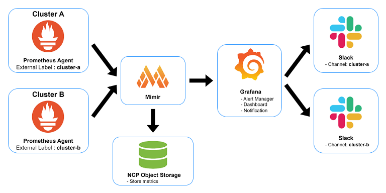
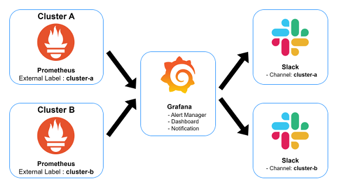
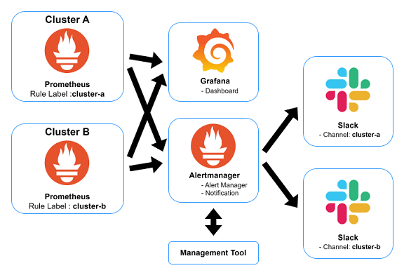

### 構成01

- <b>Prometheus:</b> メトリクスを外部に保存 + アラートはGrafanaが処理するため、Agentモードを利用
- <b>Mimir:</b> メトリクスを長期保存（NCP Object Storage利用）+ アラート機能があるが、未確認
- <b>Grafana:</b> アラート + ダッシュボード + 通知

| Pros | Cons |
|--|--|
| - 各クラスタのPrometheus管理が楽になる。 - Grafanaアラートを利用するため、設定管理が楽になる。 | - 管理必要なリソースの増加(Mimir)  - ダッシュボード + アラート設定によるGrafanaの負荷問題 |

### 構成02

- Prometheus: メトリクスを保存 + アラート + 通知
- Grafana: ダッシュボード

| Pros | Cons |
|--|--|
| - 監視とアラートがGrafana1つで可能。 | - 各クラスタごとデータソースとアラート管理が必要  - ダッシュボード + アラート設定によるGrafanaの負荷問題 |

### 構成03

- Prometheus: メトリクスを保存 + アラート + 通知
- 管理ツール：アラート追加/削除
- Grafana: ダッシュボード

| Pros | Cons |
|--|--|
| - パフォーマンスを気にせずアラート設定可能 | 監視とアラートツールが分離  - まとめてアラート設定可能なツール作成が必要 |
