# アラート設定説明

## アラート

### Alert rules
- [Alert rules](https://grafana.com/docs/grafana/latest/alerting/fundamentals/alert-rules/)
- アラートをいつトリガーするかについての一連の評価基準。
- アラートルールのタイプには以下2つがある。
  | / | Grafana-managed alert rule | Data source-managed alert rule |
  |---|---|---|
  | 利用可能なデータソース | アラートをサポートするデータソース | Prometheus基盤データソースのみ |
  | データソースの組み合わせ | 可能 | 不可 |
  | データ変換とアラート条件の設定 | 可能 | 不可 |
  | 通知時にイメージ使用 | 可能 | 不可 |
  | アラート ルールの評価と配信 | 外部Alertmanagerを使用  => Grafana内または両方で行われる | 分散されるため、単一障害点がない |

## アラートルールの評価

### Evaluation group

- [Evaluation group](https://grafana.com/docs/grafana/latest/alerting/fundamentals/alert-rule-evaluation/#evaluation-group)
- アラートルールをチェックする頻度設定。
- 例）10秒頻度でアラートルールをチェックする。

### Pending period

- [Pending period](https://grafana.com/docs/grafana/latest/alerting/fundamentals/alert-rule-evaluation/#pending-period)
- 条件がどれだけ続けばアラートがトリガーされるかを決める。
- 例）Podが1分間ダウンしたらアラートをトリガーする。

## 通知

### Contact points

- [Contact points](https://grafana.com/docs/grafana/latest/alerting/fundamentals/notifications/contact-points/)
- Mail/Slackなどの通知先に関する設定を行う。

### Template

- 通知メッセージのカスタマイズが可能
- Default template: 
[default_template.go](https://github.com/grafana/alerting/blob/main/templates/default_template.go)
- [Templates](https://grafana.com/docs/grafana/latest/alerting/fundamentals/templates/)
- [Template notifications](https://grafana.com/docs/grafana/latest/alerting/configure-notifications/template-notifications/)

### Notification policies

- [Notification policies](https://grafana.com/docs/grafana/latest/alerting/fundamentals/notifications/notification-policies/)
- ラベルごとの通知先を設定したりいろいろ柔軟な通知設定が可能。
- 例）cluster01ラベルのアラート通知はSlackのcluster01チャンネルに送る。

## 通知の無効化

以下2つの機能があるが、どちらも通知を停止するだけで、アラートは問題なくトリガーされる。

### Mute timing

- [Mute timing](https://grafana.com/docs/grafana/latest/alerting/configure-notifications/mute-timings/)
- 定期的なメンテナンスなど特定の繰り返し期間に通知を停止する。

### Silence

- [Silences](https://grafana.com/docs/grafana/latest/alerting/configure-notifications/create-silence/)
- 特定時間枠に通知を停止する。

## Export / Import

- Importした設定はUIから変更不可。
- Importで作成したリソースは`provisioned`マークが付く。 
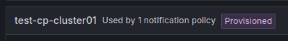
- Exportのために作成した設定は必ず削除すること。  => 設定が反映されなかったりする。  => 削除せずImportした場合など、操作できなくなった場合はマニフェストで削除。  => サンプル 
  ~~~yaml
  apiVersion: 1
  deleteDatasources:
  - name: Prometheus
    orgId: 1
  ..........
  ~~~
- Export/Import方法は下記の各リンクを参照  => 基本的にUIからExportしてGrafanaの特定ディレクトリ(`provisioning/alerting`)にファイルとして配置する形～
  - Export
    - [Alert rules](https://grafana.com/docs/grafana/latest/alerting/set-up/provision-alerting-resources/export-alerting-resources/#export-from-the-grafana-ui)
    - [Contact points](https://grafana.com/docs/grafana/latest/alerting/set-up/provision-alerting-resources/export-alerting-resources/#export-contact-points)
    - [Templates](https://grafana.com/docs/grafana/latest/alerting/set-up/provision-alerting-resources/export-alerting-resources/#export-templates)
    - [Notification policies](https://grafana.com/docs/grafana/latest/alerting/set-up/provision-alerting-resources/export-alerting-resources/#export-the-notification-policy-tree)
    - [Mute timings](https://grafana.com/docs/grafana/latest/alerting/set-up/provision-alerting-resources/export-alerting-resources/#export-mute-timings)
  - Import
    - [Alert rules](https://grafana.com/docs/grafana/latest/alerting/set-up/provision-alerting-resources/file-provisioning/#import-alert-rules)
    - [Contact points](https://grafana.com/docs/grafana/latest/alerting/set-up/provision-alerting-resources/file-provisioning/#import-contact-points)
    - [Templates](https://grafana.com/docs/grafana/latest/alerting/set-up/provision-alerting-resources/file-provisioning/#import-templates)
    - [Notification policies](https://grafana.com/docs/grafana/latest/alerting/set-up/provision-alerting-resources/file-provisioning/#import-notification-policies)
    - [Mute timings](https://grafana.com/docs/grafana/latest/alerting/set-up/provision-alerting-resources/file-provisioning/#import-mute-timings)

# Test01

## Scenario

<b>※各クラスタのPrometheusを個別データソースとしてGrafanaに登録する構成を前提とする。</b>
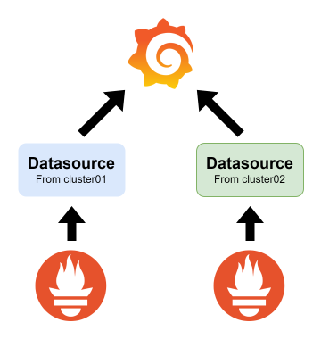

- アラートルール
  - ルール１：`nginx01`コンテナが1分間ダウンするとアラートをトリガー
  - ルール２：`nginx02`コンテナが1分間ダウンするとアラートをトリガー
  - ルール３：DeploymentのReplicas > `2`になるとアラートをトリガー
  - ルール４：DeploymentのReplicas < `1`になるとアラートをトリガー
- 通知ポリシー
  - ラベル`cluster: cluster01`のアラートはContact points 01が処理
  - ラベル`cluster: cluster02`のアラートはContact points 02が処理
  - ラベル`target: all`のアラートはContact points 03が処理
  - ラベル`deployment: nginx01`のアラートはContact points 01が処理
  - ラベル`deployment: nginx02`のアラートはContact points 02が処理
- コンタクトポイント
  - Contact points 01の通知先はSlackの`grafana_cluster01`チャンネル
  - Contact points 02の通知先はSlackの`grafana_cluster02`チャンネル
  - Contact points 02の通知先はSlackの`grafana_cluster01`と`grafana_cluster02`

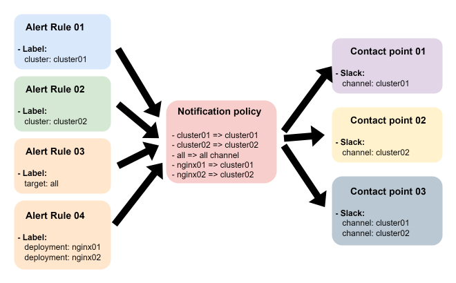

## Manifest

### Grafana

grafana.yaml

~~~yaml
apiVersion: v1
kind: PersistentVolumeClaim
metadata:
  name: grafana-pvc
  namespace: monitoring
spec:
  storageClassName: openebs-hostpath
  accessModes:
    - ReadWriteOnce
  resources:
    requests:
      storage: 5Gi
---
apiVersion: apps/v1
kind: Deployment
metadata:
  labels:
    app: grafana
  name: grafana
  namespace: monitoring
spec:
  selector:
    matchLabels:
      app: grafana
  template:
    metadata:
      labels:
        app: grafana
    spec:
      securityContext:
        fsGroup: 472
        supplementalGroups:
          - 0
      containers:
        - name: grafana
          image: grafana/grafana:latest
          imagePullPolicy: IfNotPresent
          ports:
            - containerPort: 3000
              name: http-grafana
              protocol: TCP
          readinessProbe:
            failureThreshold: 3
            httpGet:
              path: /robots.txt
              port: 3000
              scheme: HTTP
            initialDelaySeconds: 10
            periodSeconds: 30
            successThreshold: 1
            timeoutSeconds: 2
          livenessProbe:
            failureThreshold: 3
            initialDelaySeconds: 30
            periodSeconds: 10
            successThreshold: 1
            tcpSocket:
              port: 3000
            timeoutSeconds: 1
          resources:
            requests:
              cpu: 250m
              memory: 750Mi
          volumeMounts:
            - mountPath: /var/lib/grafana
              name: grafana-pv
            - mountPath: /etc/grafana/provisioning/datasources
              name: datasource
            - mountPath: /etc/grafana/provisioning/alerting
              name: alerting
      volumes:
        - name: grafana-pv
          persistentVolumeClaim:
            claimName: grafana-pvc
        - name: datasource
          configMap:
            name: datasource
        - name: alerting
          configMap:
            name: alerting
---
apiVersion: v1
kind: Service
metadata:
  name: grafana
  namespace: monitoring
spec:
  ports:
    - port: 3000
      protocol: TCP
      targetPort: http-grafana
  selector:
    app: grafana
  sessionAffinity: None
~~~

datasource.yaml

~~~yaml
apiVersion: v1
data:
  datasource.yaml: |
    apiVersion: 1
    deleteDatasources:
    - name: Prometheus
      orgId: 1
    datasources:
    - name: cluster01
      type: prometheus
      url: http://test-kube-prometheus-stack-prometheus.monitoring:9090/
      access: proxy
      isDefault: true
      jsonData:
        httpMethod: POST
        timeInterval: 30s
    - name: cluster02
      type: prometheus
      url: http://test-kube-prometheus-stack-prometheus.monitoring:9090/
      access: proxy
      isDefault: false
      jsonData:
        httpMethod: POST
        timeInterval: 30s
kind: ConfigMap
metadata:
  name: datasource
  namespace: monitoring
~~~

alerting.yaml

~~~yaml
apiVersion: v1
data:
  alerting.yaml: |
    apiVersion: 1
    groups:
        - orgId: 1
          name: alert-test-group
          folder: alert-test
          interval: 1m
          rules:
            - uid: ce4hl95vvu874a
              title: Container_Down_01
              condition: C
              data:
                - refId: A
                  relativeTimeRange:
                    from: 600
                    to: 0
                  datasourceUid: P055C9A05FB996225
                  model:
                    editorMode: code
                    expr: kube_pod_container_status_ready{namespace="default", container="nginx01"}
                    instant: true
                    intervalMs: 1000
                    legendFormat: __auto
                    maxDataPoints: 43200
                    range: false
                    refId: A
                - refId: C
                  datasourceUid: __expr__
                  model:
                    conditions:
                        - evaluator:
                            params:
                                - 1
                            type: lt
                          operator:
                            type: and
                          query:
                            params:
                                - C
                          reducer:
                            params: []
                            type: last
                          type: query
                    datasource:
                        type: __expr__
                        uid: __expr__
                    expression: A
                    intervalMs: 1000
                    maxDataPoints: 43200
                    refId: C
                    type: threshold
              noDataState: NoData
              execErrState: Error
              for: 1m
              labels:
                cluster: cluster01
              isPaused: false
            - uid: ce4hm1lrxi0hse
              title: Container_Down_02
              condition: C
              data:
                - refId: A
                  relativeTimeRange:
                    from: 600
                    to: 0
                  datasourceUid: P8657736FA8F9067B
                  model:
                    datasource:
                        type: prometheus
                        uid: P8657736FA8F9067B
                    editorMode: code
                    expr: kube_pod_container_status_ready{namespace="default", container="nginx02"}
                    instant: true
                    intervalMs: 1000
                    legendFormat: __auto
                    maxDataPoints: 43200
                    range: false
                    refId: A
                - refId: C
                  datasourceUid: __expr__
                  model:
                    conditions:
                        - evaluator:
                            params:
                                - 1
                            type: lt
                          operator:
                            type: and
                          query:
                            params:
                                - C
                          reducer:
                            params: []
                            type: last
                          type: query
                    datasource:
                        type: __expr__
                        uid: __expr__
                    expression: A
                    intervalMs: 1000
                    maxDataPoints: 43200
                    refId: C
                    type: threshold
              noDataState: NoData
              execErrState: Error
              for: 1m
              labels:
                cluster: cluster02
              isPaused: false
            - uid: be4hmjxev78xsd
              title: Over_Replicas
              condition: C
              data:
                - refId: A
                  relativeTimeRange:
                    from: 600
                    to: 0
                  datasourceUid: P055C9A05FB996225
                  model:
                    editorMode: code
                    expr: kube_deployment_spec_replicas{namespace="default"}
                    instant: true
                    intervalMs: 1000
                    legendFormat: __auto
                    maxDataPoints: 43200
                    range: false
                    refId: A
                - refId: C
                  datasourceUid: __expr__
                  model:
                    conditions:
                        - evaluator:
                            params:
                                - 2
                            type: gt
                          operator:
                            type: and
                          query:
                            params:
                                - C
                          reducer:
                            params: []
                            type: last
                          type: query
                    datasource:
                        type: __expr__
                        uid: __expr__
                    expression: A
                    intervalMs: 1000
                    maxDataPoints: 43200
                    refId: C
                    type: threshold
              noDataState: NoData
              execErrState: Error
              for: 1m
              labels:
                target: all
              isPaused: false
            - uid: ce4iw4c0fl2psc
              title: No_Pods
              condition: C
              data:
                - refId: A
                  relativeTimeRange:
                    from: 600
                    to: 0
                  datasourceUid: P055C9A05FB996225
                  model:
                    editorMode: code
                    expr: kube_deployment_spec_replicas{namespace="default"}
                    instant: true
                    intervalMs: 1000
                    legendFormat: __auto
                    maxDataPoints: 43200
                    range: false
                    refId: A
                - refId: C
                  datasourceUid: __expr__
                  model:
                    conditions:
                        - evaluator:
                            params:
                                - 1
                            type: lt
                          operator:
                            type: and
                          query:
                            params:
                                - C
                          reducer:
                            params: []
                            type: last
                          type: query
                    datasource:
                        type: __expr__
                        uid: __expr__
                    expression: A
                    intervalMs: 1000
                    maxDataPoints: 43200
                    refId: C
                    type: threshold
              noDataState: NoData
              execErrState: Error
              for: 1m
              isPaused: false
    contactPoints:
      - orgId: 1
        name: test-cp-cluster01
        receivers:
          - uid: test-cp-cluster01
            type: slack
            settings:
              recipient: grafana_cluster01
              text: '{{ template "test.message" . }}'
              title: '{{ template "test.title" . }}'
              token: XXXXXXXXXXXXXXXXXXXX
            disableResolveMessage: false
      - orgId: 1
        name: test-cp-cluster02
        receivers:
          - uid: test-cp-cluster02
            type: slack
            settings:
              recipient: grafana_cluster02
              text: '{{ template "test.message" . }}'
              title: '{{ template "test.title" . }}'
              token: XXXXXXXXXXXXXXXXXXXX
            disableResolveMessage: false
      - orgId: 1
        name: test-cp-cluster
        receivers:
          - uid: test-cp-cluster
            type: slack
            settings:
              recipient: grafana_cluster01
              text: '{{ template "test.message" . }}'
              title: '{{ template "test.title" . }}'
              token: XXXXXXXXXXXXXXXXXXXX
            disableResolveMessage: false
          - uid: ee4hid0hjopvka
            type: slack
            settings:
              recipient: grafana_cluster02
              text: '{{ template "test.message" . }}'
              title: '{{ template "test.title" . }}'
              token: XXXXXXXXXXXXXXXXXXXX
            disableResolveMessage: false
    templates:
      - orgID: 1
        name: test_template
        template: |
          {{ define "test.title" }}[{{ .Status | toUpper }}] {{ .CommonLabels.alertname }}{{ end }}

          {{ define "test.message" }}
          {{ range .Alerts }}
          - Cluster: {{ .Labels.cluster }}
          - Namespace: {{ .Labels.namespace }}
          - Pod: {{ .Labels.pod }}
          - Container: {{ .Labels.container }}
          {{ end }}
          {{ end }}
    policies:
      - orgId: 1
        receiver: grafana-default-email
        group_by:
          - grafana_folder
          - alertname
        routes:
          - receiver: test-cp-cluster01
            object_matchers:
              - - cluster
                - =
                - cluster01
          - receiver: test-cp-cluster02
            object_matchers:
              - - cluster
                - =
                - cluster02
          - receiver: test-cp-cluster01
            object_matchers:
              - - deployment
                - =
                - nginx01
          - receiver: test-cp-cluster02
            object_matchers:
              - - deployment
                - =
                - nginx02
          - receiver: test-cp-cluster
            object_matchers:
              - - target
                - =
                - all
kind: ConfigMap
metadata:
  name: alerting
  namespace: monitoring
~~~

### Nginx

deploy.yaml

~~~yaml
apiVersion: apps/v1
kind: Deployment
metadata:
  name: nginx01
  labels:
    app: nginx01
spec:
  selector:
    matchLabels:
      app: nginx01
  replicas: 2
  template:
    metadata:
      labels:
        app: nginx01
    spec:
      containers:
      - name: nginx01
        image: nginx:1.27.2
        lifecycle:
          postStart:
            exec:
              command: ["/bin/sh", "-c", "touch /tmp/healthcheck.txt"]
        readinessProbe:
          exec:
            command: ["cat", "/tmp/healthcheck.txt"]
          initialDelaySeconds: 5
          periodSeconds: 5
          failureThreshold: 3
          timeoutSeconds: 1
          successThreshold: 1
---
apiVersion: apps/v1
kind: Deployment
metadata:
  name: nginx02
  labels:
    app: nginx02
spec:
  selector:
    matchLabels:
      app: nginx02
  replicas: 2
  template:
    metadata:
      labels:
        app: nginx02
    spec:
      containers:
      - name: nginx02
        image: nginx:1.27.2
        lifecycle:
          postStart:
            exec:
              command: ["/bin/sh", "-c", "touch /tmp/healthcheck.txt"]
        readinessProbe:
          exec:
            command: ["cat", "/tmp/healthcheck.txt"]
          initialDelaySeconds: 5
          periodSeconds: 5
          failureThreshold: 3
          timeoutSeconds: 1
          successThreshold: 1
~~~

## Test

### cluster01のアラート確認

- テストコマンド
  ~~~
  kubectl exec deploy/nginx01 -- rm -rf /tmp/healthcheck.txt
  kubectl rollout restart deploy nginx01
  ~~~

- Slack確認 
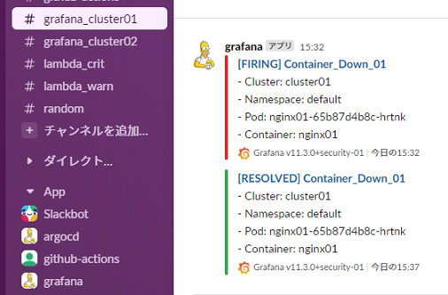

### cluster02のアラート確認

- テストコマンド
  ~~~
  kubectl exec deploy/nginx02 -- rm -rf /tmp/healthcheck.txt
  kubectl rollout restart deploy nginx02
  ~~~

- Slack確認 
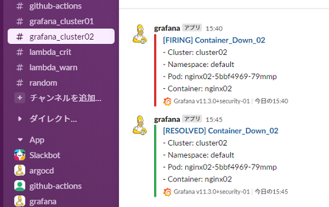

### 複数の通知先確認01

1つのアラートを複数の通知先へ転送

- テストコマンド
  ~~~
  kubectl scale deployment nginx01 --replicas 3
  kubectl scale deployment nginx01 --replicas 2
  ~~~

- Slack確認 
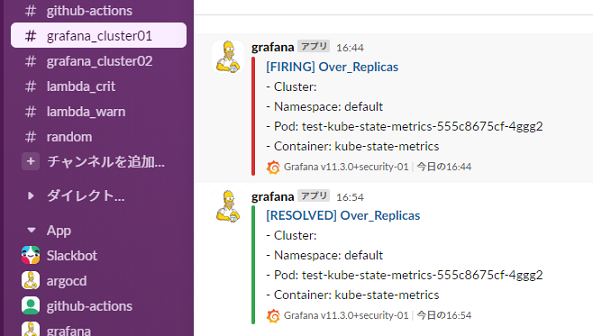 
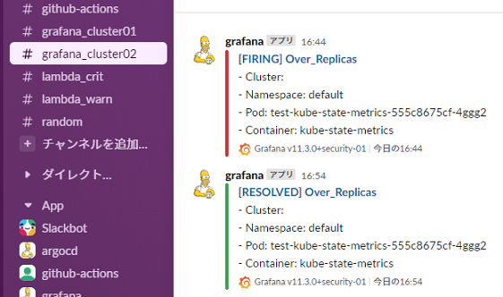

### 複数の通知先確認02

1つのルールから条件に従って異なる通知先へ転送

- テストコマンド
  ~~~
  kubectl scale deployment nginx01 --replicas 0
  ~~~

- Slack確認 
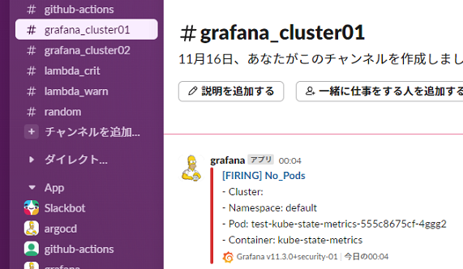 
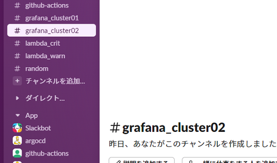

- テストコマンド
  ~~~
  kubectl scale deployment nginx02 --replicas 0
  ~~~

- Slack確認 
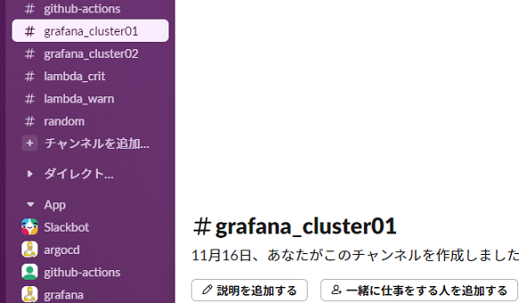 
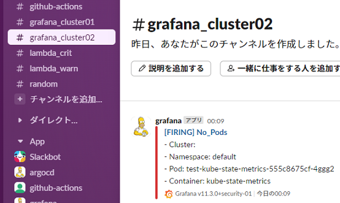

# Test02

## 通知停止(Silenceのみテスト実施)

### Silence設定
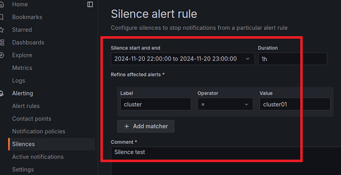

### コンテナダウン

- 通知停止対象のNginx01と非対象のNginx02をダウン
  ~~~
  kubectl exec deploy/nginx01 -- rm -rf /tmp/healthcheck.txt
  kubectl exec deploy/nginx02 -- rm -rf /tmp/healthcheck.txt
  ~~~

### 確認

- 通知停止してもアラートはトリガーされる。 
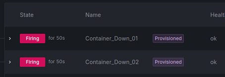
- 非対象側のみ通知される。 
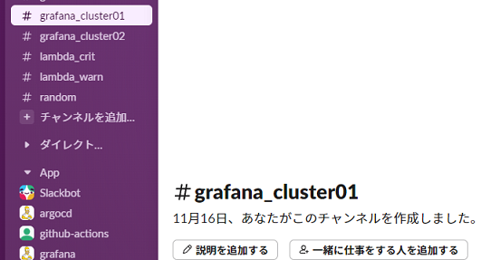 
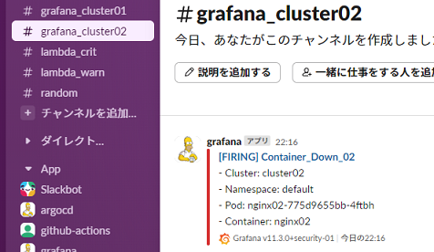
- 削除。 Silenceを無効すると5日後に自動削除される。 
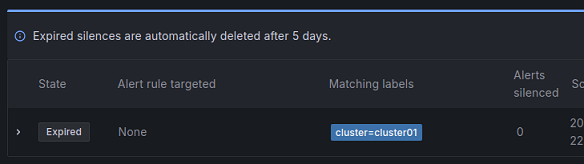
