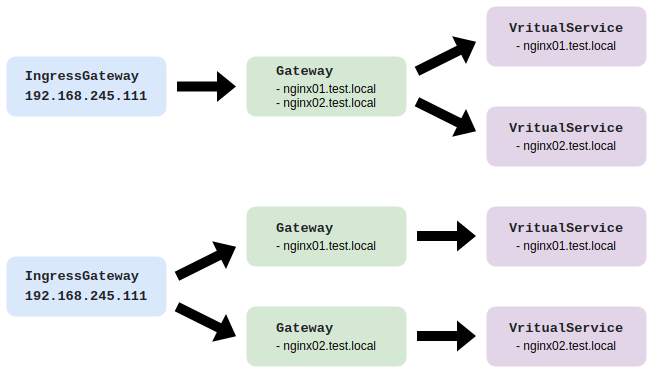
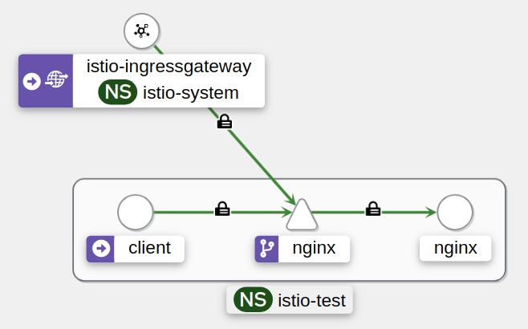
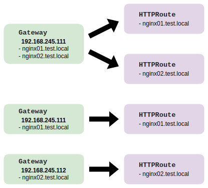
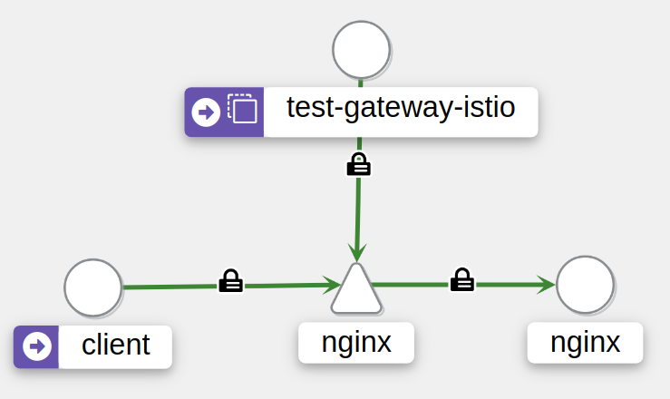
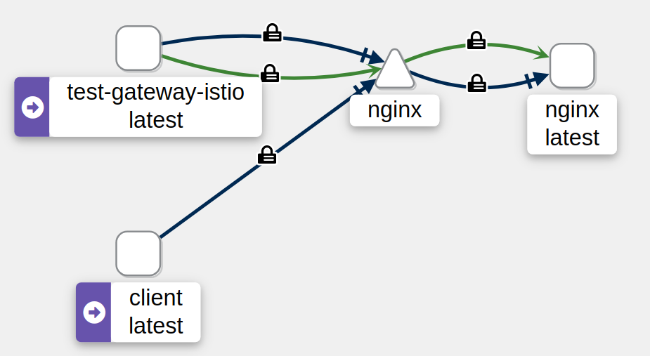

### Istio default

- Gateway Sample 

- Resource
~~~
$ kubectl -n istio-system get deploy
NAME                   READY   UP-TO-DATE   AVAILABLE   AGE
istio-ingressgateway   1/1     1            1           2m20s
istiod                 1/1     1            1           2m28s

$ kubectl -n istio-system get svc
NAME                   TYPE           CLUSTER-IP      EXTERNAL-IP       PORT(S)                                      AGE
istio-ingressgateway   LoadBalancer   10.104.175.95   192.168.245.111   15021:30111/TCP,80:31367/TCP,443:31190/TCP   2m53s
istiod                 ClusterIP      10.99.32.33     <none>            15010/TCP,15012/TCP,443/TCP,15014/TCP        3m1s
~~~

- Communication
~~~
$ curl -ksI https://nginx.test.local
HTTP/2 200 
server: istio-envoy
date: Fri, 30 Aug 2024 13:25:24 GMT
content-type: text/html
content-length: 615
last-modified: Mon, 12 Aug 2024 14:21:01 GMT
etag: "66ba1a4d-267"
accept-ranges: bytes
x-envoy-upstream-service-time: 1
~~~

- Logs Enable access log needed
~~~
$ kubectl -n istio-system logs deployments/istio-ingressgateway
....................
[1900-01-01T13:37:50.182Z] "HEAD / HTTP/2" 200 - via_upstream - "-" 0 0 2 1 "192.168.245.106" "curl/8.5.0" "c8dc14f0-4c6a-4278-bde7-07c3b727eb44" "nginx.test.local" "10.0.100.247:80" outbound|80||nginx.istio-test.svc.cluster.local 10.0.99.134:35782 10.0.99.134:8443 192.168.245.106:49059 nginx.test.local -
[1900-01-01T13:37:51.228Z] "HEAD / HTTP/2" 200 - via_upstream - "-" 0 0 2 1 "192.168.245.106" "curl/8.5.0" "a887e066-07f5-46e1-b057-5e48ade12169" "nginx.test.local" "10.0.100.247:80" outbound|80||nginx.istio-test.svc.cluster.local 10.0.99.134:35782 10.0.99.134:8443 192.168.245.106:15052 nginx.test.local -
[1900-01-01T13:37:52.262Z] "HEAD / HTTP/2" 200 - via_upstream - "-" 0 0 2 2 "192.168.245.106" "curl/8.5.0" "92a6ace9-6481-4792-ac8c-69617cd75ddf" "nginx.test.local" "10.0.100.247:80" outbound|80||nginx.istio-test.svc.cluster.local 10.0.99.134:35782 10.0.99.134:8443 192.168.245.106:61836 nginx.test.local -
[1900-01-01T13:37:53.301Z] "HEAD / HTTP/2" 200 - via_upstream - "-" 0 0 2 1 "192.168.245.106" "curl/8.5.0" "2b83fb9a-5419-46d5-8c69-4488119f36db" "nginx.test.local" "10.0.100.247:80" outbound|80||nginx.istio-test.svc.cluster.local 10.0.99.134:35796 10.0.99.134:8443 192.168.245.106:6022 nginx.test.local -
....................
~~~

- kiali 

- Manifest
~~~yaml
apiVersion: v1
kind: Namespace
metadata:
  name: istio-test
  labels:
    name: istio-test
    istio-injection: enabled
---
apiVersion: networking.istio.io/v1
kind: Gateway
metadata:
  name: test-gateway
  namespace: istio-system
spec:
  selector:
    istio: ingressgateway
  servers:
  - port:
      number: 443
      name: https
      protocol: HTTPS
    tls:
      mode: SIMPLE
      credentialName: test-cert
    hosts:
    - "nginx.test.local"
---
apiVersion: networking.istio.io/v1
kind: VirtualService
metadata:
  name: test-vs
  namespace: istio-test
spec:
  gateways:
  - istio-system/test-gateway
  hosts:
  - "nginx.test.local"
  http:
  - route:
    - destination:
        host: nginx
        port:
          number: 80
---
apiVersion: v1
kind: Service
metadata:
  name: nginx
  namespace: istio-test
spec:
  selector:
    app: nginx
  ports:
  - name: http
    port: 80
    targetPort: 80
---
apiVersion: v1
kind: Pod
metadata:
  name: nginx
  namespace: istio-test
  labels:
    app: nginx
spec:
  containers:
  - name: nginx
    image: nginx:1.27.1
    imagePullPolicy: IfNotPresent
    ports:
    - containerPort: 80
~~~

### Istio Kubernetes Gateway API

- Gateway Sample 

- GatewayClass
~~~
$ kubectl get gatewayclass
NAME           CONTROLLER                    ACCEPTED   AGE
istio          istio.io/gateway-controller   True       8m13s
istio-remote   istio.io/unmanaged-gateway    True       8m13s
~~~

- Resource
~~~
$ kubectl -n istio-test get gtw
NAME           CLASS   ADDRESS           PROGRAMMED   AGE
test-gateway   istio   192.168.245.111   True         2m44s

$ kubectl -n istio-test get httproute
NAME      HOSTNAMES              AGE
test-hr   ["nginx.test.local"]   2m52s

$ kubectl -n istio-test get pod
NAME                                  READY   STATUS    RESTARTS   AGE
..........
test-gateway-istio-566d875574-vrmpt   1/1     Running   0          26s

$ kubectl -n istio-test get svc
NAME                 TYPE           CLUSTER-IP      EXTERNAL-IP       PORT(S)                         AGE
..........
test-gateway-istio   LoadBalancer   10.96.170.67    192.168.245.111   15021:31769/TCP,443:32216/TCP   47s
~~~

- Communication
~~~
$ curl -ksI https://nginx.test.local
HTTP/2 200 
server: istio-envoy
date: Fri, 30 Aug 2024 18:43:15 GMT
content-type: text/html
content-length: 615
last-modified: Mon, 12 Aug 2024 14:21:01 GMT
etag: "66ba1a4d-267"
accept-ranges: bytes
x-envoy-upstream-service-time: 1
~~~

- Logs Enable access log needed
~~~
$ kubectl -n istio-test logs deployments/test-gateway-istio
..........
[1900-01-01T18:48:34.378Z] "HEAD / HTTP/2" 200 - via_upstream - "-" 0 0 2 2 "192.168.245.106" "curl/8.5.0" "3b0a9aed-2448-48f9-9011-8a53bd066e4b" "nginx.test.local" "10.0.100.214:80" outbound|80||nginx.istio-test.svc.cluster.local 10.0.100.213:36844 10.0.100.213:443 192.168.245.106:48146 nginx.test.local istio-test.test-hr.0
[1900-01-01T18:48:35.415Z] "HEAD / HTTP/2" 200 - via_upstream - "-" 0 0 1 1 "192.168.245.106" "curl/8.5.0" "d1a713a1-ba01-4836-8b3d-1d6b2666073c" "nginx.test.local" "10.0.100.214:80" outbound|80||nginx.istio-test.svc.cluster.local 10.0.100.213:36852 10.0.100.213:443 192.168.245.106:13782 nginx.test.local istio-test.test-hr.0
[1900-01-01T18:48:36.453Z] "HEAD / HTTP/2" 200 - via_upstream - "-" 0 0 2 1 "192.168.245.106" "curl/8.5.0" "6108d5c0-6af3-447e-b1ce-6accf2002b93" "nginx.test.local" "10.0.100.214:80" outbound|80||nginx.istio-test.svc.cluster.local 10.0.100.213:36852 10.0.100.213:443 192.168.245.106:36879 nginx.test.local istio-test.test-hr.0
[1900-01-01T18:48:37.491Z] "HEAD / HTTP/2" 200 - via_upstream - "-" 0 0 1 1 "192.168.245.106" "curl/8.5.0" "06214818-9c3a-431b-a692-afa7514abbd1" "nginx.test.local" "10.0.100.214:80" outbound|80||nginx.istio-test.svc.cluster.local 10.0.100.213:36844 10.0.100.213:443 192.168.245.106:61397 nginx.test.local istio-test.test-hr.0
~~~

- kiali 

- Manifest
~~~yaml
apiVersion: v1
kind: Namespace
metadata:
  name: istio-test
  labels:
    name: istio-test
    istio-injection: enabled
---
apiVersion: gateway.networking.k8s.io/v1
kind: Gateway
metadata:
  name: test-gateway
  namespace: istio-test
  annotations:
    cert-manager.io/cluster-issuer: ca-issuer
spec:
  gatewayClassName: istio
  listeners:
  - name: https
    hostname: "nginx.test.local"
    port: 443
    protocol: HTTPS
    tls:
      mode: Terminate
      certificateRefs:
        - kind: Secret
          group: ""
          name: test-gateway-crt
          namespace: istio-test
    allowedRoutes:
      namespaces:
        from: All
---
apiVersion: gateway.networking.k8s.io/v1
kind: HTTPRoute
metadata:
  name: test-hr
  namespace: istio-test
spec:
  parentRefs:
  - name: test-gateway
    namespace: istio-test
    sectionName: https
  hostnames: ["nginx.test.local"]
  rules:
  - matches:
    - path:
        type: PathPrefix
        value: /
    backendRefs:
    - name: nginx
      port: 80
---
apiVersion: v1
kind: Service
metadata:
  name: nginx
  namespace: istio-test
spec:
  selector:
    app: nginx
  ports:
  - name: http
    port: 80
    targetPort: 80
---
apiVersion: v1
kind: Pod
metadata:
  name: nginx
  namespace: istio-test
  labels:
    app: nginx
spec:
  containers:
  - name: nginx
    image: nginx:1.27.1
    imagePullPolicy: IfNotPresent
    ports:
    - containerPort: 80
~~~

### Istio Ambient

- GatewayClass
~~~
$ kubectl get gatewayclass
NAME             CONTROLLER                    ACCEPTED   AGE
istio            istio.io/gateway-controller   True       102m
istio-remote     istio.io/unmanaged-gateway    True       102m
istio-waypoint   istio.io/mesh-controller      True       102m
~~~

- Resource
~~~
$ kubectl get ns istio-test --show-labels 
NAME         STATUS   AGE   LABELS
istio-test   Active   23s   istio.io/dataplane-mode=ambient,kubernetes.io/metadata.name=istio-test,name=istio-test

$ kubectl -n istio-test get gtw
NAME           CLASS   ADDRESS           PROGRAMMED   AGE
test-gateway   istio   192.168.245.111   True         2m44s

$ kubectl -n istio-test get httproute
NAME      HOSTNAMES              AGE
test-hr   ["nginx.test.local"]   2m52s

$ kubectl -n istio-test get pod
NAME                                  READY   STATUS    RESTARTS   AGE
..........
test-gateway-istio-566d875574-vrmpt   1/1     Running   0          26s

$ kubectl -n istio-test get svc
NAME                 TYPE           CLUSTER-IP      EXTERNAL-IP       PORT(S)                         AGE
..........
test-gateway-istio   LoadBalancer   10.96.170.67    192.168.245.111   15021:31769/TCP,443:32216/TCP   47s
~~~

- Communication
~~~
$ curl -ksI https://nginx.test.local
HTTP/2 200 
server: istio-envoy
date: Fri, 30 Aug 2024 18:43:15 GMT
content-type: text/html
content-length: 615
last-modified: Mon, 12 Aug 2024 14:21:01 GMT
etag: "66ba1a4d-267"
accept-ranges: bytes
x-envoy-upstream-service-time: 1
~~~

- Logs Enable access log needed
~~~
$ kubectl -n istio-test logs deployments/test-gateway-istio
..........
[1900-01-01T12:37:21.695Z] "HEAD / HTTP/2" 200 - via_upstream - "-" 0 0 1 1 "192.168.245.106" "curl/8.5.0" "00c9840e-2bfc-4a9c-a8eb-e05845157e2a" "nginx.test.local" "envoy://connect_originate/10.0.100.232:80" outbound|80||nginx.istio-test.svc.cluster.local envoy://internal_client_address/ 10.0.100.230:443 192.168.245.106:54245 nginx.test.local istio-test.test-hr.0
[1900-01-01T12:37:22.731Z] "HEAD / HTTP/2" 200 - via_upstream - "-" 0 0 1 1 "192.168.245.106" "curl/8.5.0" "68308647-6c58-4917-875d-5b21eb59ca4a" "nginx.test.local" "envoy://connect_originate/10.0.100.232:80" outbound|80||nginx.istio-test.svc.cluster.local envoy://internal_client_address/ 10.0.100.230:443 192.168.245.106:38131 nginx.test.local istio-test.test-hr.0
[1900-01-01T12:37:23.768Z] "HEAD / HTTP/2" 200 - via_upstream - "-" 0 0 1 1 "192.168.245.106" "curl/8.5.0" "ba030c55-3cd1-4000-be9d-636aa867633a" "nginx.test.local" "envoy://connect_originate/10.0.100.232:80" outbound|80||nginx.istio-test.svc.cluster.local envoy://internal_client_address/ 10.0.100.230:443 192.168.245.106:53191 nginx.test.local istio-test.test-hr.0
[1900-01-01T12:37:24.802Z] "HEAD / HTTP/2" 200 - via_upstream - "-" 0 0 1 1 "192.168.245.106" "curl/8.5.0" "8691586f-4104-4dad-afbb-e8ffae449198" "nginx.test.local" "envoy://connect_originate/10.0.100.232:80" outbound|80||nginx.istio-test.svc.cluster.local envoy://internal_client_address/ 10.0.100.230:443 192.168.245.106:58906 nginx.test.local istio-test.test-hr.0
~~~

- kiali 

- Manifest
~~~yaml
apiVersion: v1
kind: Namespace
metadata:
  name: istio-test
  labels:
    name: istio-test
    istio.io/dataplane-mode: ambient
---
apiVersion: gateway.networking.k8s.io/v1
kind: Gateway
metadata:
  name: test-gateway
  namespace: istio-test
  annotations:
    cert-manager.io/cluster-issuer: ca-issuer
spec:
  gatewayClassName: istio
  listeners:
  - name: https
    hostname: "nginx.test.local"
    port: 443
    protocol: HTTPS
    tls:
      mode: Terminate
      certificateRefs:
        - kind: Secret
          group: ""
          name: test-gateway-crt
          namespace: istio-test
    allowedRoutes:
      namespaces:
        from: All
---
apiVersion: gateway.networking.k8s.io/v1
kind: HTTPRoute
metadata:
  name: test-hr
  namespace: istio-test
spec:
  parentRefs:
  - name: test-gateway
    namespace: istio-test
    sectionName: https
  hostnames: ["nginx.test.local"]
  rules:
  - matches:
    - path:
        type: PathPrefix
        value: /
    backendRefs:
    - name: nginx
      port: 80
---
apiVersion: v1
kind: Service
metadata:
  name: nginx
  namespace: istio-test
spec:
  selector:
    app: nginx
  ports:
  - name: http
    port: 80
    targetPort: 80
---
apiVersion: v1
kind: Pod
metadata:
  name: nginx
  namespace: istio-test
  labels:
    app: nginx
spec:
  containers:
  - name: nginx
    image: nginx:1.27.1
    imagePullPolicy: IfNotPresent
    ports:
    - containerPort: 80
~~~
