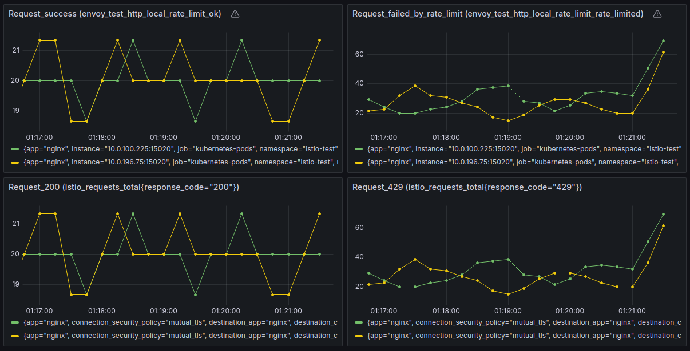

### Local Rate Limit

<https://istio.io/latest/docs/tasks/policy-enforcement/rate-limit/#local-rate-limit> 
<https://imesh.ai/blog/istio-rate-limiting-local/>

### Global Rate Limit

<https://istio.io/latest/docs/tasks/policy-enforcement/rate-limit/#global-rate-limit> 
<https://imesh.ai/blog/istio-rate-limiting-global/> 
<https://learncloudnative.com/blog/2023-07-23-global-rate-limiter> 
<https://qiita.com/yuuchii/items/970b252d419d41fa4f8d>

# Local Rate Limit

### いろいろ

- Global Rate Limitとは動作が異なるため、注意。
  - 各Podごとリクエストを数える。
  - 例：10リクエスト/1分に制限設定する場合
    - Replicasが「1」の場合：Pod数 x 10リクエストで1分間の許容リクエスト数は「10」
    - Replicasが「2」の場合：Pod数 x 10リクエストで1分間の許容リクエスト数は「20」

### 設定

- テスト環境作成
~~~yaml
kind: Namespace
apiVersion: v1
metadata:
  name: istio-test
  labels:
    name: istio-test
    istio-injection: enabled
---
apiVersion: networking.istio.io/v1beta1
kind: Gateway
metadata:
  name: rate-limit
  namespace: istio-system
spec:
  selector:
    istio: ingressgateway
  servers:
  - port:
      number: 80
      name: http
      protocol: HTTP
    hosts:
    - "*"
---
apiVersion: networking.istio.io/v1beta1
kind: VirtualService
metadata:
  name: rate-limit
  namespace: istio-test
spec:
  gateways:
  - istio-system/rate-limit
  hosts:
  - "nginx.test.local"
  http:
  - route:
    - destination:
        host: nginx
        port:
          number: 80
---
apiVersion: v1
kind: Service
metadata:
  name: nginx
  namespace: istio-test
spec:
  selector:
    app: nginx
  ports:
  - name: http
    port: 80
    targetPort: 80
---
apiVersion: apps/v1
kind: Deployment
metadata:
  name: nginx
  labels:
    app: nginx
  namespace: istio-test
spec:
  selector:
    matchLabels:
      app: nginx
  replicas: 2
  template:
    metadata:
      labels:
        app: nginx
    spec:
      containers:
      - name: nginx
        image: nginx:1.27.1
        ports:
        - name: http
          containerPort: 80
~~~

- Rate Limit設定
~~~yaml
apiVersion: networking.istio.io/v1alpha3
kind: EnvoyFilter
metadata:
  name: rate-limit
  namespace: istio-test # Ratelimitを設定するNamespace
spec:
  workloadSelector: # Ratelimitを設定するPodのラベル
    labels:
      app: nginx
  configPatches:
    - applyTo: HTTP_FILTER
      match:
        context: SIDECAR_INBOUND
        listener:
          filterChain:
            filter:
              name: "envoy.filters.network.http_connection_manager"
      patch:
        operation: INSERT_BEFORE
        value:
          name: envoy.filters.http.local_ratelimit
          typed_config:
            "@type": type.googleapis.com/udpa.type.v1.TypedStruct
            type_url: type.googleapis.com/envoy.extensions.filters.http.local_ratelimit.v3.LocalRateLimit
            value:
              stat_prefix: test
              token_bucket:     # 1分(60s)間のリクエスト数を「10」に制限
                max_tokens: 10
                tokens_per_fill: 10
                fill_interval: 60s
              filter_enabled:
                runtime_key: local_rate_limit_enabled
                default_value:
                  numerator: 100
                  denominator: HUNDRED
              filter_enforced:
                runtime_key: local_rate_limit_enforced
                default_value:
                  numerator: 100
                  denominator: HUNDRED
              response_headers_to_add:
                - append: false
                  header:
                    key: x-local-rate-limit
                    value: 'true'
~~~

### 確認

- コマンド
~~~
curl -sI http://192.168.245.111 -H 'host: nginx.test.local'
~~~

- istio-proxyログ
~~~
[2024-09-15T16:27:43.206Z] "HEAD / HTTP/1.1" 200 - via_upstream - "-" 0 0 0 0 "192.168.245.106" "curl/8.5.0" "3180f9f0-3d98-465c-a211-c422de42a98f" "nginx.test.local" "10.0.196.75:80" inbound|80|| 127.0.0.6:57631 10.0.196.75:80 192.168.245.106:0 outbound_.80_._.nginx.istio-test.svc.cluster.local default
[2024-09-15T16:27:43.843Z] "HEAD / HTTP/1.1" 200 - via_upstream - "-" 0 0 1 0 "192.168.245.106" "curl/8.5.0" "6f3ae7d7-1bdf-474b-8aa3-80f4098b850d" "nginx.test.local" "10.0.196.75:80" inbound|80|| 127.0.0.6:57631 10.0.196.75:80 192.168.245.106:0 outbound_.80_._.nginx.istio-test.svc.cluster.local default
[2024-09-15T16:27:47.040Z] "HEAD / HTTP/1.1" 200 - via_upstream - "-" 0 0 0 0 "192.168.245.106" "curl/8.5.0" "04340f83-2bb0-4465-906b-c42d8ebde8a9" "nginx.test.local" "10.0.196.75:80" inbound|80|| 127.0.0.6:57631 10.0.196.75:80 192.168.245.106:0 outbound_.80_._.nginx.istio-test.svc.cluster.local default
[2024-09-15T16:27:47.687Z] "HEAD / HTTP/1.1" 429 RL local_rate_limited - "-" 0 0 0 - "192.168.245.106" "curl/8.5.0" "467a7648-b9ef-4e9b-b75b-f9f500a88589" "nginx.test.local" "-" inbound|80|| - 10.0.196.75:80 192.168.245.106:0 outbound_.80_._.nginx.istio-test.svc.cluster.local default
[2024-09-15T16:27:48.328Z] "HEAD / HTTP/1.1" 429 RL local_rate_limited - "-" 0 0 0 - "192.168.245.106" "curl/8.5.0" "a56e7b27-876b-4f19-8cb3-9698dce710b8" "nginx.test.local" "-" inbound|80|| - 10.0.196.75:80 192.168.245.106:0 outbound_.80_._.nginx.istio-test.svc.cluster.local default
~~~

- Grafana 

