# IAM Identity Center ユーザーの初回ログイン

### ログインに必要な情報と作業

- AWS Access Portal URL
  - https://d-9567908020.awsapps.com/start
- ログインユーザーのメールアドレス
- スマホにMFA用認証アプリがインストール済みであること
  - AWS公式のテスト済みアプリ 
    | 対応OS | アプリ |
    | --- | --- |
    | iOS（iPhone） Android | Google Authenticator Microsoft Authenticator Authy Duo Mobile |

### ブラウザを開き、AWS access portal URLにアクセス

- URL: https://d-9567908020.awsapps.com/start

### Usernameにユーザーのメールアドレスを入力し、[Next]をクリック

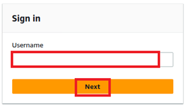

### 認証コード確認

- ユーザー宛てに以下メールが届いていることを確認する
  - タイトル：Verify your identity
  - 送信元：no-reply@login.awsapps.com
- メールを開き、`Verification code`を確認する 
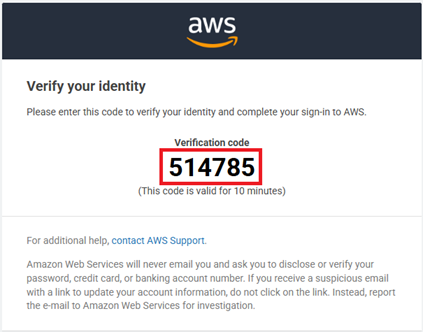

### 認証コードの入力

- ブラウザに戻り、メールで確認したコードを入力し、[Sign in]をクリックする
- メールが届いていない場合や認証コードの有効期限が切れた場合は、[Resend code]をクリックして認証コードを再送信する。 
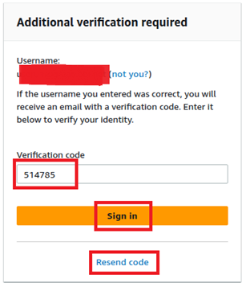

### MFAの設定

- MFA設定は必須のため、スキップできない
- [Authenticator app]を選択し、[Next]をクリックする 
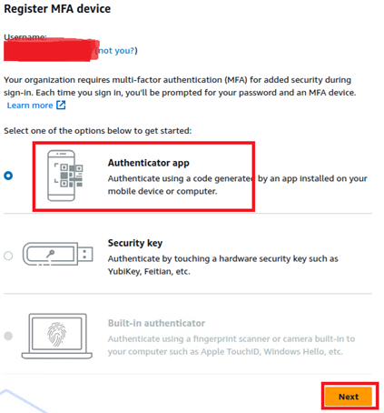
- スマホのカメラを利用できる場合
  - [Show QR code]をクリックする 
  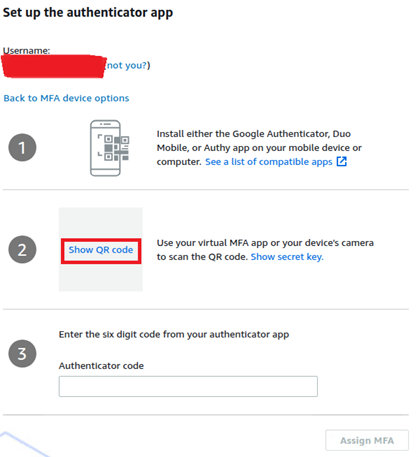
  - スマホの認証アプリでQRコードをスキャンする 
  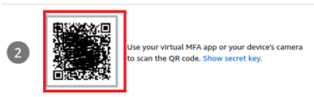
- スマホのカメラを利用できない場合 
  - [Show secret key]をクリックする 
  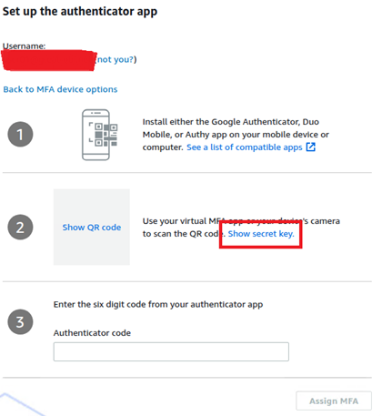
  - 画面に表示されたシークレットキーを認証アプリに登録する 
  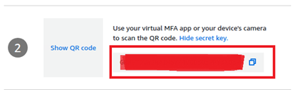
- 認証アプリに表示された認証コードを入力し、[Assign MFA]をクリックする 
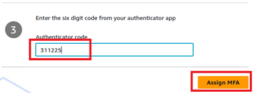
- 以下のように`successfully registered.`と表示されたら、[Done]をクリックする 
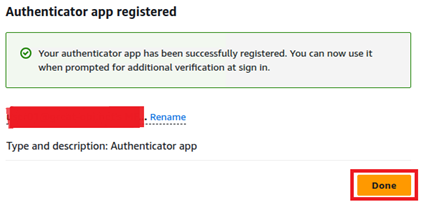

### パスワード設定

- パスワードポリシー
  - 文字数：8文字以上、64文字以下。
  - 文字種：小文字、大文字、数字、記号をそれぞれ1文字以上含める。
  - パスワードの再利用制限：直近3世代のパスワードは再利用不可
  - 漏えい済みパスワードの利用禁止：過去に流出したことが知られているパスワードは使用不可。
- PasswordとConfirm passwordを入力し、[Set new password]をクリックする 
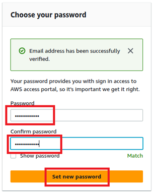
- AWS Access Portalが表示されたら、初回ログインは完了 
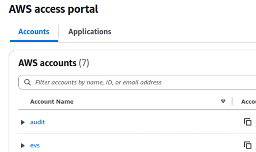
